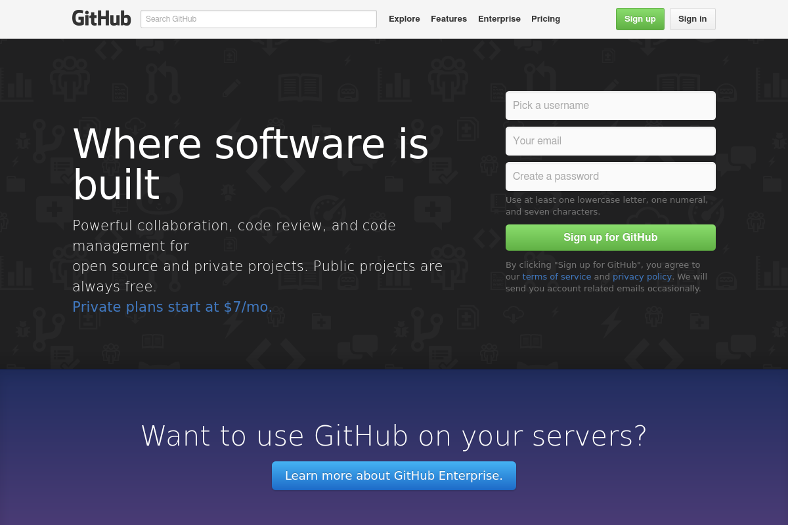

[](https://travis-ci.org/hotrush/Webshotter)
[](https://github.com/hotrush/webshotter/releases)
[](LICENSE.md)
[](https://packagist.org/packages/hotrush/webshotter)

# Webshotter

Take website's screenshots with PHP/PhantomJS and save them to PNG, JPG or PDF.

Also you can take a look at simple microservice with lumen and this package - [hotrush/Webshotter-microservice](https://github.com/hotrush/Webshotter-microservice).

## Changelog
***0.1.5*** - custom ```$templatePath``` fixed, thanks to [mizansyed](https://github.com/mizansyed)
***0.1.3*** - added ```timeout``` property that allow to limit page load timeout (using [onResourceTimeout](http://phantomjs.org/api/webpage/handler/on-resource-timeout.html) phantomjs feature). If timeout reached ```TimeoutException``` will be thrown.

## Installation

```
composer require hotrush/webshotter
```

## Laravel installation

After installing package via composer add a service provider to your config/app.php
```
// app/config/app.php

'providers' => [
    ...,
    hotrush\Webshotter\WebshotServiceProvider::class
];
```

## Usage

```
$webshot = new hotrush\Webshotter\Webshot();
$jpg = $webshot
    ->setUrl('https://github.com')
    ->setWidth(1200)
    ->setHeight(800)
    ->setTimeout(5) // set timeout in seconds, 30 seconds default
    ->setFullPage(true) // set to true to get full page screenshot (width/height will be used for viewport only)
    ->saveToPng('github', $path);
```

You can use ```saveToJpg```, ```saveToPng``` or ```saveToPdf``` methods. This methods requires 2 parameters: file name (without extension) and target directory to save file. They all returns full path to saved file

If you want to use you own PhantomJs executable - you can specify path to it via constructor.

```
new hotrush\Webshotter\Webshot('/path/to/phantomjs');
```

Example screenshot:

[](github.png)

## License

The MIT License (MIT). Please see [License File](LICENSE.md) for more information.
